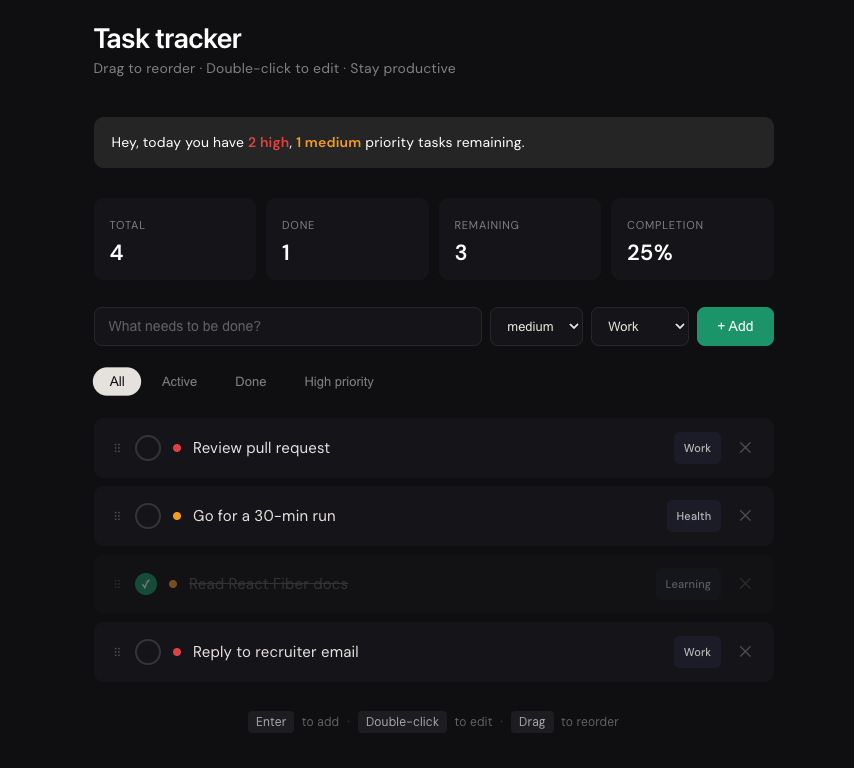

# Task Tracker

A personal productivity app to track daily tasks with priority management, drag-to-reorder, and real-time completion stats.

**Live demo → [ceng9488-create.github.io/task-tracker](https://ceng9488-create.github.io/task-tracker/)**



---

## Features

- Add, edit, and remove tasks
- Priority levels — high, medium, low
- Category tags — Work, Health, Learning, Personal
- Drag and drop to reorder
- Filter by status or priority
- Daily summary with priority breakdown
- Completion progress bar and stats

## Tech Stack

- React 19
- TypeScript
- Vite
- CSS Modules

## Project Structure

```
src/
├── components/       # UI components (one job each)
├── hooks/            # useTaskManager — all state logic
├── types/            # Shared TypeScript types
└── const/            # Shared constants
```

## Getting Started

```bash
npm install
npm run dev
```

## Build

```bash
npm run build
```
